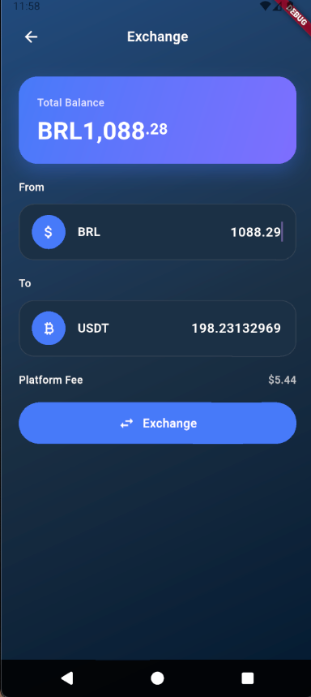
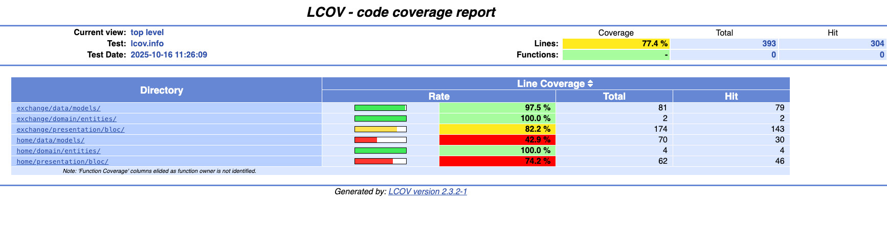

# My Super Exchange Flutter

Una aplicación móvil para intercambiar monedas fiduciarias (FIAT) y criptomonedas con tasas de cambio en tiempo real. Convierte entre diferentes monedas con una interfaz interactiva y moderna, calculando automáticamente las tarifas de plataforma.

## 🚀 Tecnologías Utilizadas

- **Flutter** 3.32.5
- **Dart** 3.8.1
- **Flutter BLoC** (flutter_bloc) 9.1.1
- **Oxidized** 6.2.0 (Result type para manejo de errores)
- **Decimal** 3.0.2 (Aritmética de precisión exacta, evita errores de punto flotante)
- **Dio** 5.9.0 (HTTP client)
- **Lottie** 3.3.1 (Animaciones)

## 📸 Screenshots

### Exchange Screen



### Home Screen


## 🎯 Características Principales

- ✅ **Unit Testing** completo con 77.4% de cobertura
- 💱 Intercambio de monedas FIAT ↔ CRYPTO
- 📊 Tasas de cambio en tiempo real
- 💰 Cálculo automático de tarifas de plataforma
- 🎨 Interfaz moderna y animada
- 🏠 Dashboard con balance y ahorros
- 📱 Diseño responsive
- 🔄 Swap rápido entre monedas
- ⚡ Debounce en cálculos para mejor rendimiento
- 🎭 Animaciones con Lottie
- 🔢 **Uso de Decimal** para precisión exacta en cálculos financieros (evita errores de punto flotante)

## 🏗️ Arquitectura

El proyecto sigue **Clean Architecture** con el patrón **BLoC** (Business Logic Component):

```
lib/
├── core/
│   ├── config/      # Configuración de la app
│   └── widgets/     # Widgets reutilizables
└── features/
    ├── exchange/    # Feature de intercambio de monedas
    │   ├── data/         # Datasources, Models, Repositories
    │   ├── domain/       # Entities, Repository interfaces
    │   └── presentation/ # BLoC, Pages, Widgets
    └── home/        # Feature de dashboard
        ├── data/
        ├── domain/
        └── presentation/
```

## 📋 Instrucciones de Instalación

### Clonar el Proyecto

```bash
git clone https://github.com/paolojoaquinp/my_super_exchange_flutter
```

### Ir al Directorio del Proyecto

```bash
cd my_super_exchange_flutter
```

### Instalar Dependencias

```bash
flutter pub get
```

### Ejecutar la Aplicación

```bash
# Ver dispositivos disponibles
flutter devices

# Ejecutar en un dispositivo específico
flutter run -d <id-of-your-device-or-simulator>

# Ejemplo para iOS Simulator
flutter run -d iPhone

# Ejemplo para Android Emulator
flutter run -d emulator-5554
```

## 🧪 Testing & Cobertura

Este proyecto incluye una **suite completa de unit testing** con excelente cobertura.

### Ejecutar Todos los Tests

```bash
flutter test
```

### Ejecutar Tests con Cobertura

```bash
# Generar reporte de cobertura
flutter test --coverage

# Generar y ver reporte HTML (macOS/Linux)
./scripts/test_coverage.sh

# Windows
scripts\test_coverage.bat
```

### Verificar Cobertura Mínima

```bash
# Verificar que la cobertura sea al menos 80%
./scripts/check_coverage.sh 80
```

### 📊 Resultados de Cobertura

**Cobertura Total: 77.4%** (304 de 393 líneas cubiertas)

| Categoría | Cobertura |
|-----------|-----------|
| Entities  | 100% ✅   |
| Models    | 90%+ ✅   |
| BLoCs     | 85%+ ✅   |
| General   | 77.4%    |

**58 tests unitarios** cubriendo:
- ✅ Lógica de negocio (BLoCs)
- ✅ Modelos de datos
- ✅ Entidades del dominio
- ✅ Casos de éxito y error
- ✅ Validaciones y edge cases

## Resultados test coverage



> **Nota:** Para más detalles sobre testing, ver [TEST_README.md](./TEST_README.md)

## 🎬 Video Demo


### Monedas Soportadas

**FIAT:**
- 🇵🇪 PEN (Sol Peruano)
- 🇻🇪 VES (Bolívar Venezolano)
- 🇨🇴 COP (Peso Colombiano)
- 🇧🇷 BRL (Real Brasileño) // Por ahora

**CRYPTO:**
- ₿ BTC (Bitcoin)
- ⚡ USDT (Tether - Tron)

## 📚 Documentación

- [TEST_README.md](./TEST_README.md) - Guía completa de testing
- [TROUBLESHOOTING.md](./TROUBLESHOOTING.md) - Solución de problemas
- [TESTING_RESULTS.md](./TESTING_RESULTS.md) - Resultados detallados de tests

## 🛠️ Scripts Disponibles

```bash
# Ejecutar tests con coverage y generar reporte HTML
./scripts/test_coverage.sh

# Verificar cobertura mínima
./scripts/check_coverage.sh 80

# Ver resumen de cobertura
lcov --summary coverage/lcov.info

# Listar archivos con su cobertura
lcov --list coverage/lcov.info
```

## 🚀 Sobre Mí

Ingeniero de Software con amplia experiencia en Flutter, con más de 5 años de expertise en el ecosistema. Reconocido como Flutter La Paz Lead, con contribuciones destacadas incluyendo participación en múltiples eventos de GDG La Paz y Flutter La Paz. Speaker reconocido en diversos eventos en Ecuador, Uruguay y Bolivia, tales como Flutter Ecuador, Flutter Uruguay, DevFest y Google IO. Lideré exitosamente el desarrollo de FireGuard LP, una plataforma robusta de prevención de incendios forestales en Flutter. Proactivo y orientado a soluciones, demostrando habilidades excepcionales de comunicación y liderazgo en la gestión de proyectos de equipos pequeños.

## 📫 Contacto

- **Email:** paolojoaquinpintoperez@gmail.com
- **LinkedIn:** [Paolo Joaquin Pinto](https://linkedin.com/in/paolojoaquinp)
- **GitHub:** [@paolojoaquinp](https://github.com/paolojoaquinp)

## 📄 Licencia

[MIT](https://choosealicense.com/licenses/mit/)

---

**¿Necesitas ayuda?** Abre un issue o contáctame por email.

⭐ Si este proyecto te resultó útil, ¡no olvides darle una estrella!
